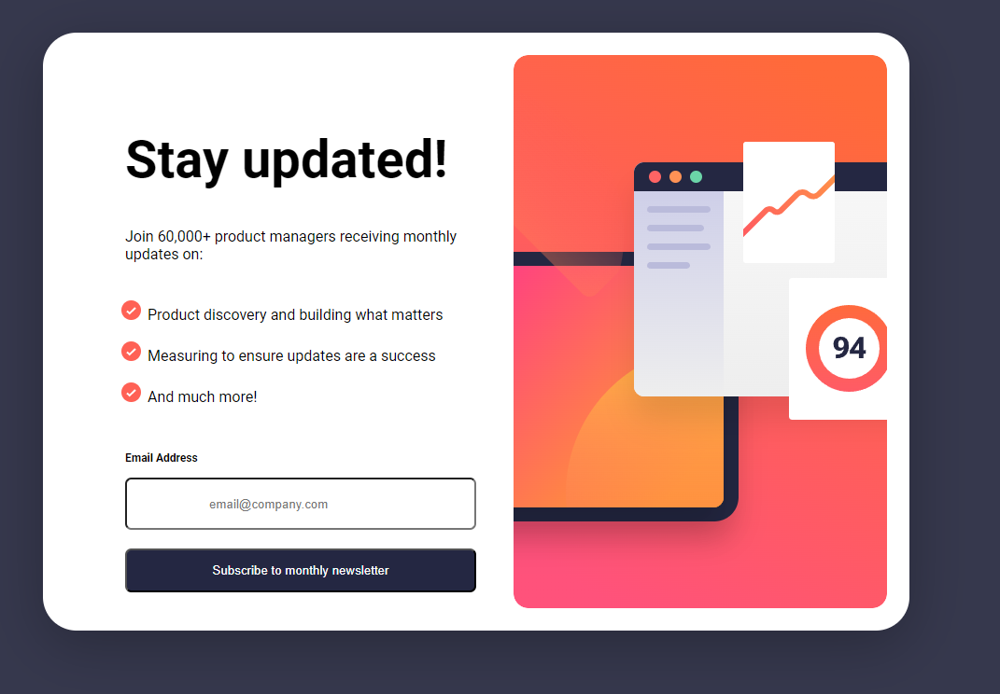

# Frontend Mentor - Newsletter sign-up form with success message solution

This is a solution to the [Newsletter sign-up form with success message challenge on Frontend Mentor](https://www.frontendmentor.io/challenges/newsletter-signup-form-with-success-message-3FC1AZbNrv). Frontend Mentor challenges help you improve your coding skills by building realistic projects. 

## Table of contents

- [Overview](#overview)
  - [The challenge](#the-challenge)
  - [Screenshot](#screenshot)
  - [Links](#links)
- [My process](#my-process)
  - [Built with](#built-with)
  - [What I learned](#what-i-learned)
  - [Continued development](#continued-development)
  - [Useful resources](#useful-resources)
- [Author](#author)
- [Acknowledgments](#acknowledgments)

## Overview

This is the Frontend Mentor NewsLetter SignUp Challenge. It is a form for a user to sign up for news letters. The user is able to 
provide an email address and is given a success message when the user provides a successful email address. If there is no successful email
address then the user is prompted with an error message.

The coding languages used are html, css, and javascript. I created a basic javascript function to create a regular expression and sanatize for any errors 
that may be included in a correct email address.

### The challenge

Users should be able to:

- Add their email and submit the form
- See a success message with their email after successfully submitting the form
- See form validation messages if:
  - The field is left empty
  - The email address is not formatted correctly
- View the optimal layout for the interface depending on their device's screen size
- See hover and focus states for all interactive elements on the page

### Screenshot

### Links

- Live Site URL: [NewsLetter SignUp](https://github.com/cloudpc7/NewsLetter)
- Solution URL: [NewsLetter SignUp](https://cloudpc7.github.io/NewsLetter/)

## My process
My process for creating this site was to create the basic html structure, then I applied the css, and javascript. 

### Built with

- Semantic HTML5 markup
- CSS custom properties
- Flexbox
- Javascript
- replit.com

### What I learned

In this challenge I learned how to display both forms using and active classlist and the css display functionality to switch between the
form and the success page. 

### Continued development

I will continue to develope my skills that I have learned to create more responsive and interactive content. 

### Useful resources

- [FrontEndMentor](https://www.frontendmentor.com) - This helped me to create projects that will enhance my coding capabilities and learn what my weakness and strenghts are. I am able to adapt once I learn a better way of doing things. 
- [codecademy](https://www.codecademy.com) - This is an amazing website that lets you learn all kinds of coding languages. I enjoy using the site to learn more about javascript and react. 

*
## Author

- Website - [Paul Cloud]
- Frontend Mentor - [@cloudpc7](https://www.frontendmentor.io/profile/yourusername)

## Acknowledgments

I would like to Acknowledge FrontEnd Mentor community for the great feedback and awesome help that they provide. for the projects that they have and the assistance. Thank you

